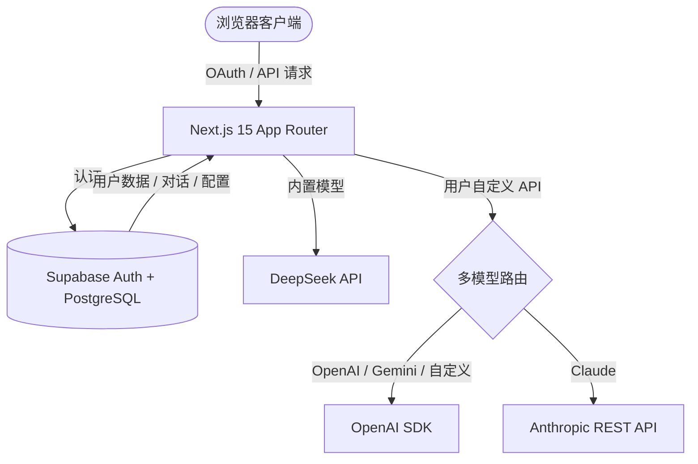

# Buuzzy Chat 💬
> 基于 Next.js 15 + Supabase + DeepSeek 构建的多模型 AI 对话助手 (v0.1.0)

<div align="center">

  <h3>你的私人多模型 AI 对话助手</h3>
  <p>Google OAuth 登录 · 多轮持久化对话 · 流式思考链 · 多模型 API 热切换</p>

  <p>
    
    
    
    
    
    
  </p>

  <p>
    <a href="#-核心功能">核心功能</a> •
    <a href="#-技术架构">技术架构</a> •
    <a href="#-快速开始">快速开始</a> •
    <a href="#-项目结构">项目结构</a> •
    <a href="#-环境变量">环境变量</a>
  </p>

</div>

---

**Buuzzy Chat** 是一款面向开发者的全功能 AI 对话助手。内置 DeepSeek 双模型，同时支持 OpenAI / Claude / Gemini / 自定义 OpenAI 兼容端点的热切换。所有对话持久化到 Supabase，配合 Google OAuth 实现完整的用户数据隔离。

## 🌟 核心功能

### 1. 🔐 安全认证
*   **Google OAuth 登录**：基于 Supabase Auth，开箱即用的第三方登录流程。
*   **用户数据隔离**：所有表启用 RLS (Row Level Security)，用户只能 CRUD 自己的数据。

### 2. 💬 多轮智能对话
*   **持久化存储**：对话历史保存到 Supabase (PostgreSQL)，跨设备同步。
*   **对话管理**：支持新建、重命名、删除对话。
*   **流式输出**：SSE 实时打字机效果，Reasoner 模型支持思考链折叠展示。

### 3. 🔑 多模型 API 热切换
*   **内置 DeepSeek 双模型**：`deepseek-chat`（快速）和 `deepseek-reasoner`（深度思考）。
*   **用户自定义 API**：支持 OpenAI / Claude / Gemini / 自定义 OpenAI 兼容端点。
*   **安全存储**：用户 API Key 存储在 Supabase 中，服务端中转调用，前端不暴露密钥。

### 4. 📋 自定义 System Prompt
*   **提示词管理**：创建、编辑、删除自定义提示词。
*   **随时切换**：在侧边栏菜单中快速切换当前会话的 System Prompt。

### 5. 🎨 Markdown 渲染
*   **代码高亮**：基于 highlight.js 的代码块语法高亮。
*   **一键复制**：代码块顶部一键复制按钮。
*   **GFM 语法**：完整支持 GitHub Flavored Markdown。

### 6. 📱 响应式布局
*   **桌面端**：侧边栏 + 主内容区经典布局。
*   **移动端**：抽屉式导航，适配小屏幕设备。

## 🏗️ 技术架构



### 技术栈

| 层级 | 技术 |
|------|------|
| 框架 | Next.js 15 (App Router, Turbopack) |
| 语言 | TypeScript |
| 样式 | Tailwind CSS + CSS Variables |
| AI 模型 | DeepSeek (内置) + OpenAI / Claude / Gemini (用户配置) |
| 认证 | Supabase Auth (Google OAuth) |
| 数据库 | Supabase (PostgreSQL) |
| Markdown | react-markdown + remark-gfm + highlight.js |

### 架构说明

*   **API 安全**：DeepSeek API Key 仅在服务端使用，用户自定义 API Key 存储在 Supabase 中。
*   **多模型路由**：服务端根据 provider 类型选择调用方式 — OpenAI/Gemini/自定义共用 OpenAI SDK，Claude 使用 Anthropic REST API。
*   **流式响应**：统一 SSE 输出格式，区分 `reasoning`（思考链）和 `content`（正文）。
*   **数据隔离**：所有表启用 RLS，用户只能 CRUD 自己的数据。

## 🚀 快速开始

### 1. 安装依赖

```bash
npm install
```

### 2. 配置环境变量

```bash
cp .env.example .env.local
```

编辑 `.env.local`，填入你的密钥（获取方式见下方）。

### 3. 配置 Supabase

#### 3.1 获取密钥

1. 前往 [Supabase Dashboard](https://supabase.com/dashboard) 创建项目
2. 进入 **Settings → API**，获取以下值填入 `.env.local`：
   - `Project URL` → `NEXT_PUBLIC_SUPABASE_URL`
   - `anon public` key → `NEXT_PUBLIC_SUPABASE_ANON_KEY`
   - `service_role` key → `SUPABASE_SERVICE_ROLE_KEY`

#### 3.2 配置 Google OAuth

1. 前往 [Google Cloud Console](https://console.cloud.google.com/) → **APIs & Services → Credentials**
2. 创建 **OAuth 2.0 Client ID**（Web application 类型）
3. 添加 **Authorized redirect URI**：
   ```
   https://<你的supabase项目>.supabase.co/auth/v1/callback
   ```
4. 回到 **Supabase Dashboard → Authentication → Providers → Google**
5. 填入 Google 的 `Client ID` 和 `Client Secret`
6. 在 **Authentication → URL Configuration** 中配置：
   - **Site URL**: `http://localhost:3000`（开发环境）或你的生产域名
   - **Redirect URLs**: 添加 `http://localhost:3000/auth/callback`

> 💡 用户注册/登录后，可在 **Supabase Dashboard → Authentication → Users** 查看用户信息。

#### 3.3 创建数据库表

进入 **Supabase Dashboard → SQL Editor**，执行以下 SQL 创建所需表：

<details>
<summary>📄 点击展开完整建表 SQL</summary>

```sql
-- ================================================
-- 1. chats 表 — 存储对话记录
-- ================================================
CREATE TABLE IF NOT EXISTS public.chats (
  id uuid PRIMARY KEY DEFAULT gen_random_uuid(),
  user_id uuid NOT NULL REFERENCES auth.users(id) ON DELETE CASCADE,
  title text DEFAULT 'New Chat',
  messages jsonb DEFAULT '[]'::jsonb,
  prompt_id uuid,
  created_at timestamptz DEFAULT now()
);

ALTER TABLE public.chats ENABLE ROW LEVEL SECURITY;

CREATE POLICY "Users can read own chats" ON public.chats
  FOR SELECT USING (auth.uid() = user_id);
CREATE POLICY "Users can insert own chats" ON public.chats
  FOR INSERT WITH CHECK (auth.uid() = user_id);
CREATE POLICY "Users can update own chats" ON public.chats
  FOR UPDATE USING (auth.uid() = user_id);
CREATE POLICY "Users can delete own chats" ON public.chats
  FOR DELETE USING (auth.uid() = user_id);

CREATE INDEX IF NOT EXISTS idx_chats_user_id ON public.chats(user_id);
CREATE INDEX IF NOT EXISTS idx_chats_created_at ON public.chats(created_at DESC);

-- ================================================
-- 2. prompts 表 — 存储自定义 System Prompt
-- ================================================
CREATE TABLE IF NOT EXISTS public.prompts (
  id uuid PRIMARY KEY DEFAULT gen_random_uuid(),
  user_id uuid NOT NULL REFERENCES auth.users(id) ON DELETE CASCADE,
  name text NOT NULL,
  content text NOT NULL DEFAULT '',
  is_preset boolean DEFAULT false,
  created_at timestamptz DEFAULT now()
);

ALTER TABLE public.prompts ENABLE ROW LEVEL SECURITY;

CREATE POLICY "Users can read own prompts" ON public.prompts
  FOR SELECT USING (auth.uid() = user_id);
CREATE POLICY "Users can insert own prompts" ON public.prompts
  FOR INSERT WITH CHECK (auth.uid() = user_id);
CREATE POLICY "Users can update own prompts" ON public.prompts
  FOR UPDATE USING (auth.uid() = user_id);
CREATE POLICY "Users can delete own prompts" ON public.prompts
  FOR DELETE USING (auth.uid() = user_id);

CREATE INDEX IF NOT EXISTS idx_prompts_user_id ON public.prompts(user_id);

-- ================================================
-- 3. api_configs 表 — 存储用户 API 配置
-- ================================================
CREATE TABLE IF NOT EXISTS public.api_configs (
  id uuid PRIMARY KEY DEFAULT gen_random_uuid(),
  user_id uuid NOT NULL REFERENCES auth.users(id) ON DELETE CASCADE,
  provider text NOT NULL CHECK (provider IN ('openai', 'claude', 'gemini', 'custom')),
  name text NOT NULL,
  api_url text NOT NULL,
  api_key text NOT NULL,
  is_active boolean DEFAULT false,
  created_at timestamptz DEFAULT now()
);

ALTER TABLE public.api_configs ENABLE ROW LEVEL SECURITY;

CREATE POLICY "Users can read own api_configs" ON public.api_configs
  FOR SELECT USING (auth.uid() = user_id);
CREATE POLICY "Users can insert own api_configs" ON public.api_configs
  FOR INSERT WITH CHECK (auth.uid() = user_id);
CREATE POLICY "Users can update own api_configs" ON public.api_configs
  FOR UPDATE USING (auth.uid() = user_id);
CREATE POLICY "Users can delete own api_configs" ON public.api_configs
  FOR DELETE USING (auth.uid() = user_id);

CREATE INDEX IF NOT EXISTS idx_api_configs_user_id ON public.api_configs(user_id);
```

</details>

> 所有表均启用了 RLS（Row Level Security），用户只能访问自己的数据。

### 4. 获取 DeepSeek API Key

1. 前往 [DeepSeek Platform](https://platform.deepseek.com/) 注册
2. 创建 API Key，填入 `.env.local` 的 `DEEPSEEK_API_KEY`

### 5. 启动开发服务器

```bash
npm run dev
```

访问 [http://localhost:3000](http://localhost:3000) 🎉

## 📁 项目结构

```
src/
├── app/
│   ├── api/
│   │   ├── chat/route.ts         # AI 对话 API（多模型路由 + SSE 流式）
│   │   └── setup/route.ts        # 数据库建表 API
│   ├── auth/callback/route.ts    # OAuth 回调
│   ├── login/page.tsx            # 登录页
│   └── page.tsx                  # 主页面
├── components/
│   ├── chat/
│   │   ├── ChatWindow.tsx        # 消息展示（Markdown + 代码高亮）
│   │   └── ChatInput.tsx         # 输入框 + 模型选择器
│   ├── layout/
│   │   └── Sidebar.tsx           # 侧边栏（对话列表 + ⋮ 菜单）
│   ├── prompt/
│   │   ├── PromptManager.tsx     # 提示词管理 Modal
│   │   └── PromptSelector.tsx    # 提示词选择芯片
│   └── settings/
│       └── ApiConfigManager.tsx  # API 配置 Modal
├── hooks/
│   ├── useChat.ts                # 对话核心逻辑
│   ├── usePrompts.ts             # 提示词 CRUD
│   └── useApiConfig.ts           # API 配置 CRUD
├── lib/
│   ├── api.ts                    # API 客户端（多模型支持）
│   └── supabase.ts               # Supabase 客户端
└── types/
    └── chat.ts                   # 类型定义
```

## 🔧 环境变量

| 变量名 | 必填 | 说明 |
|--------|:----:|------|
| `DEEPSEEK_API_KEY` | ✅ | DeepSeek API 密钥 |
| `NEXT_PUBLIC_SUPABASE_URL` | ✅ | Supabase 项目 URL |
| `NEXT_PUBLIC_SUPABASE_ANON_KEY` | ✅ | Supabase 匿名 Key（客户端） |
| `SUPABASE_SERVICE_ROLE_KEY` | ✅ | Supabase 管理员 Key（仅服务端） |

## 📝 更新日志

<details>
<summary>查看完整变更记录</summary>

### 2026-02-13

#### feat: 侧边栏菜单 + 多模型 API 配置
- 侧边栏退出按钮替换为 `⋮` 菜单（配置提示词 / 配置 API / 退出）
- 新增 ApiConfigManager Modal，支持 OpenAI / Claude / Gemini / 自定义四种供应商
- 服务端多 provider 路由：DeepSeek (内置) + OpenAI/Gemini/自定义 (OpenAI SDK) + Claude (Anthropic REST)
- 选中自定义 API 时隐藏 DeepSeek 模型选择器
- 新增 `api_configs` 表 SQL + RLS
- 输入框上方 PromptSelector 移除，入口统一到侧边栏菜单

#### feat: 自定义 System Prompt 管理
- 新增 PromptManager Modal（创建、编辑、删除、选择提示词）
- 新增 `prompts` 表 SQL + RLS
- 提示词内容在发消息时传给 API，替代硬编码 System Prompt

#### feat: Supabase 持久化 + Google OAuth
- 对话数据从 localStorage 迁移至 Supabase
- 新增 Google OAuth 登录流程
- 新增 `chats` 表 SQL + RLS + 索引

#### feat: DeepSeek Reasoner 双模型
- 支持 `deepseek-chat`（快速）和 `deepseek-reasoner`（深度思考）
- Reasoner 思考链 SSE 分离展示，支持折叠/展开

#### init: 基础 Chatbot
- Next.js 15 + TypeScript 项目初始化
- DeepSeek Chat API 接入 + SSE 流式输出
- Markdown 渲染 + 代码高亮 + 一键复制
- 响应式侧边栏 + 移动端适配

</details>

## 📄 License

MIT

---

<div align="center">
  <sub>Built with ❤️ using Next.js, Supabase & DeepSeek</sub>
</div>
